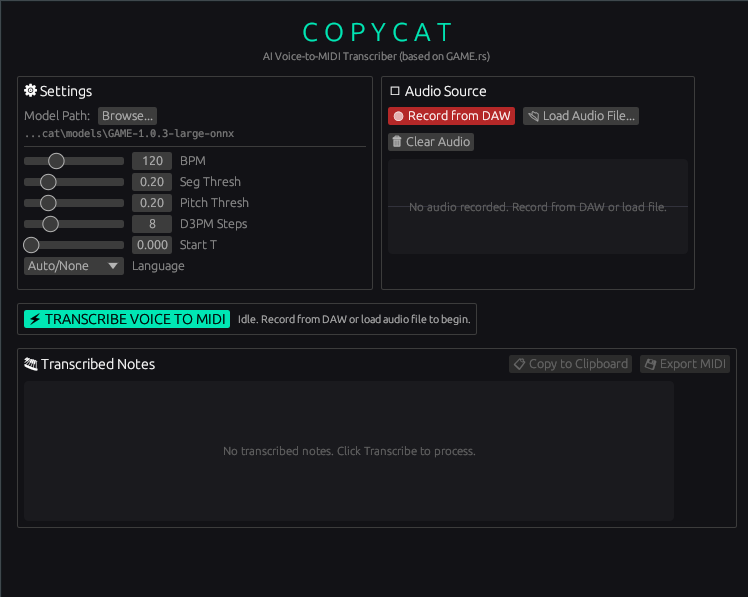

# Copycat — AI Voice-to-MIDI

A VST3/CLAP plugin that transcribes vocal audio into MIDI notes using
[GAME (Generative Adaptive MIDI Extractor)](https://github.com/openvpi/GAME). Specifically, it's based on my project [GAME.rs](https://github.com/HeapHeapHooray/GAME.rs). Made with Gemini and Deepseek 🚀  
   
Confirmed to fully work on FL Studio through Wine (Bottles) in Linux.



Built with [nih-plug](https://github.com/robbert-vdh/nih-plug).

## Features

- **AI Transcription**: Voice-to-MIDI transcription via ONNX neural network models.
- **Audio Inputs**: Record audio from DAW input or load audio files (WAV, FLAC, MP3, OGG).
- **Real-time Playback**: Real-time MIDI note output during DAW playback.
- **Visual Piano Roll**: Visual interface with note names.
- **📋 Copy to Clipboard**: Copy transcribed MIDI notes directly to the clipboard (uses standard MIDI file bytes, fully compatible with FL Studio's "Paste from MIDI clipboard" feature).
- **Flexible Parameters**: Adjustable BPM, segmentation, pitch estimation, and diffusion steps.
- **Language Hints**: Support for English, Japanese, Cantonese, and Mandarin.
- **Cross-Platform & Wine Compatibility**: Works on Windows and Linux, including Wine compatibility (GUI rendering fallback to OpenGL 2.1).

## Installation

Download the release archive for your platform from [GitHub Releases](https://github.com/HeapHeapHooray/Copycat/releases).

The package includes a one-click CLI installer (`copycat_installer`) that automates setting up the plugin and downloading the required model files.

```
Usage: copycat_installer [OPTIONS]

Options:
  -s, --silent          Run the installer silently without opening the GUI
  -m, --model-dir <DIR> Specify the destination directory for the model (default: platform-specific path)
  -h, --help            Print help information
```

### Windows
1. Extract the release ZIP.
2. Run `copycat_installer.exe`.
   - *Note: If you run it normally, it will install the plugin to your user-local directories. Run it as Administrator if you want to install it system-wide.*
3. The installer will:
   - Copy `copycat.clap` to your CLAP directory (e.g. `C:\Program Files\Common Files\CLAP`).
   - Copy `copycat.vst3` directory to your VST3 directory (e.g. `C:\Program Files\Common Files\VST3`).
   - Download the model checkpoint (`GAME-1.0.3-large-onnx`) and extract it to:  
     `C:\Users\<YourUsername>\copycat\models\GAME-1.0.3-large-onnx`

### Linux
1. Extract the release tarball.
2. Open a terminal, navigate to the extracted directory, and run the installer:
   ```bash
   ./copycat_installer
   ```
3. The installer will:
   - Copy `copycat.clap` to `~/.clap/`
   - Copy `copycat.vst3` to `~/.vst3/`
   - Download the model checkpoint (`GAME-1.0.3-large-onnx`) and extract it to:  
     `~/.local/share/copycat/models/GAME-1.0.3-large-onnx`

---

## How-to-use in FL Studio (Adapt accordingly to your DAW)

### 1. Load the Plugin
Load **Copycat** as an audio effect plugin on any mixer insert channel (e.g., your vocal channel).

### 2. Configure Model Path
In the plugin GUI, click the **Browse...** button under **Model Path** and select the folder where the checkpoint was installed:
* **Windows**: `C:\Users\<YourUsername>\copycat\models\GAME-1.0.3-large-onnx`
* **Linux**: `~/.local/share/copycat/models/GAME-1.0.3-large-onnx`

### 3. Record or Load Audio
* **Record**: Click **🔴 Record from DAW** in the plugin GUI, press play in FL Studio to play the vocal audio, and click **⏹ Stop Recording** once the performance is complete.
* **Load File**: Alternatively, click **📂 Load Audio File...** to import a pre-recorded vocal file (`.wav`, `.mp3`, `.flac`, `.ogg`).

### 4. Transcribe
* Configure parameters like **BPM (Tempo)**, **Pitch/Seg Thresholds**, and **D3PM Steps**.
* Click **⚡ TRANSCRIBE VOICE TO MIDI**. The status bar will show the transcription progress and notes count.

### 5. Export / Use MIDI Notes
* **Copy to Clipboard (FL Studio specific)**: Click **📋 Copy to Clipboard**. Open the Piano Roll of your target instrument channel (e.g., 3xOsc, Serum), click the Piano Roll options menu at the top-left, and select **File -> Paste from MIDI clipboard** (or press standard `Shift+Ctrl+V` shortcut).
* **Export File**: Click **💾 Export MIDI** to save a standard `.mid` file to disk.
* **Real-time Playback**: Since Copycat is loaded as an audio effect, you must route its MIDI output to your target instrument inside FL Studio:
  1. Open the Copycat plugin window, and click the **Gear icon** (top-left) to open the Wrapper settings.
  2. Under **Output Port** (in the Wrapper's detailed settings), set it to a port number (e.g., `1`).
  3. Load your target synthesizer (e.g., Serum, Kontakt, or any VST/CLAP instrument).
  4. Open the synthesizer's Wrapper settings, and set its **Input Port** to match the same number (e.g., `1`).
  5. Play your track in FL Studio to hear the transcribed notes play through the synth in real-time.

---

## Building from Source

### Prerequisites
Make sure you have Rust and Cargo installed.

### 1. Compile the Plugin

#### Linux
```bash
cargo xtask bundle copycat --release
```

#### Windows (native, recommended)
```powershell
cargo xtask bundle copycat --release --target x86_64-pc-windows-msvc
```

#### Windows (cross-compile from Linux)
```bash
rustup target add x86_64-pc-windows-gnu
sudo apt install mingw-w64
cargo xtask bundle copycat --release --target x86_64-pc-windows-gnu
```

### 2. Compile the Installer
Build the installer package for your target architecture:

#### Linux
```bash
cargo build --package copycat_installer --release
cp target/release/copycat_installer target/bundled/
```

#### Windows (native)
```powershell
cargo build --package copycat_installer --release --target x86_64-pc-windows-msvc
Copy-Item target/x86_64-pc-windows-msvc/release/copycat_installer.exe target/bundled/
```

`target/bundled/` will now contain the complete package:
- `copycat_installer` (or `copycat_installer.exe`)
- `copycat.clap`
- `copycat.vst3/`

### GitHub Actions Build
The project uses GitHub Actions (`.github/workflows/build.yml`) to automatically compile the plugin and installer binaries for both platforms on every tag release (e.g. pushing a tag starting with `v*`).

---

## Notes

- `nih-plug-patched/` is a local fork with OpenGL 2.1 fallback for Wine compatibility and `catch_unwind` wrappers on all FFI entry points to prevent host crashes.
